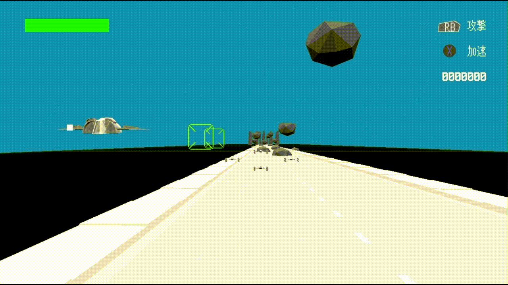
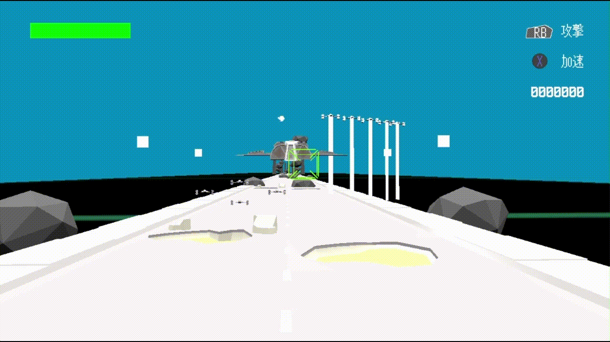
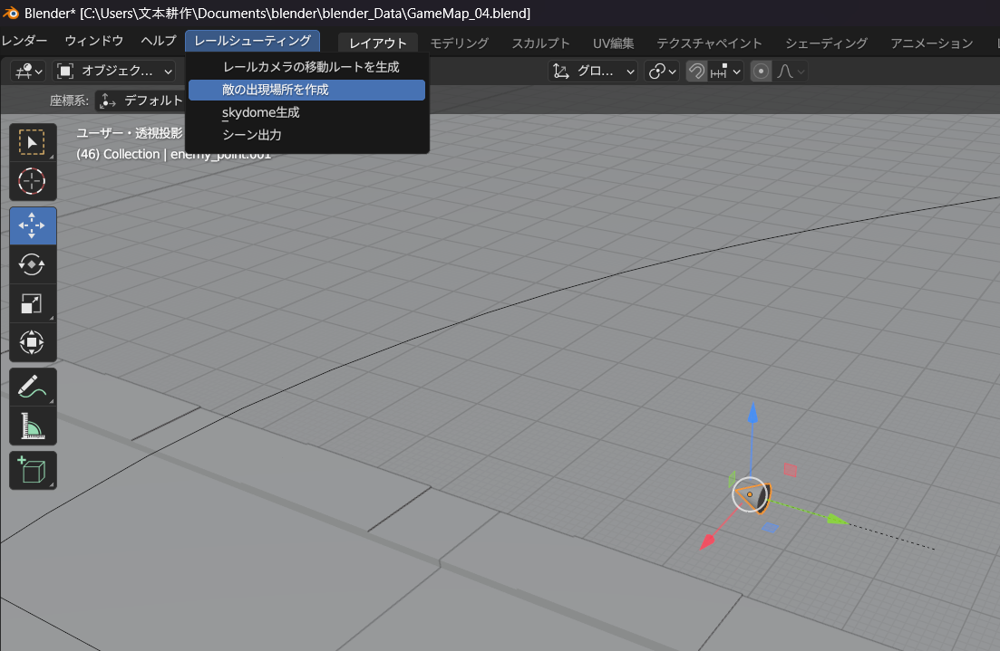
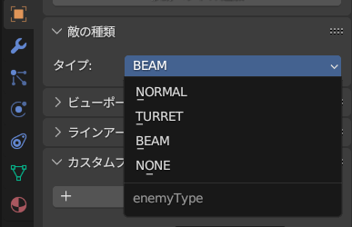
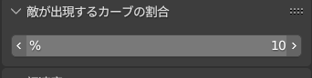
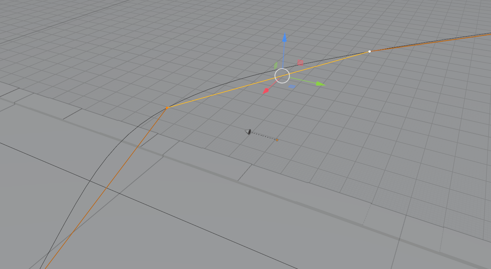
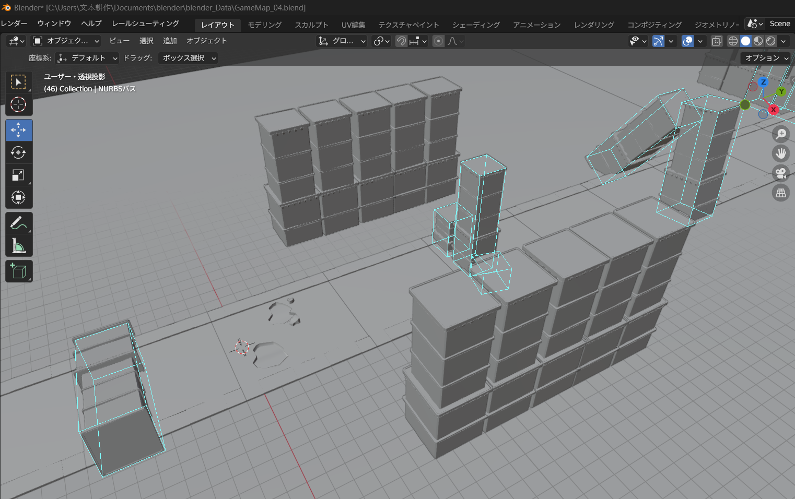
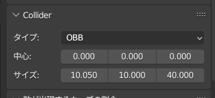
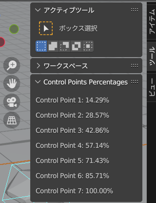

# 就職作品について
## 3Dルート固定レールシューティング
スターフォックス64やEx-zodiacのような動かしているだけで気持ちいい自機の操作性や、障害物をぎりぎりでよける緊張感を目指して製作に取り組んでいます

## ゲーム概要
迫りくる敵や障害物をひたすらよけてゴールを目指する3Dルート固定レールシューティングです。  
ゲームスピードが速いので反射神経が求められるゲームです。  

## 自機の挙動  
操作しているだけで気持ち良いと思えるように自機の動きを大げさにし、カメラの動きも激しくなるような演出を実装しました。  

 - ### ブースト機能
   コントローラーのXボタンを押している間加速します。加速中はラジアルブラーをかけ、カメラのFovを上げて通り過ぎるものがより速く見えるようにしました。
   
  
 - ### 回避機能
   コントローラーAボタンを押すと移動方向に向かって素早く移動します。回避時は自機から残像が出るようにしました。
   レスポンスを向上させるため、回避の硬直は少なくして、何度でも押しやすいようにしました。
   
  
## Blenderを利用したレベルエディタ
Blenderのアドオン開発を行い以下の設定を行えるようにしました。

### 敵の出現情報  
"敵の出現場所を生成"タブをクリックするとトーラスモデルとNURBSパスが生成されます。トーラスモデルは敵の向きを表し、NURBSパスは敵の移動ルートです。

 - #### 種類  
 
 - #### 出現タイミング
 レールカメラがどのくらい進んだら敵を発生させるかを設定することができます  
 
 - #### 移動ルートの編集
 

### 障害物の配置  
 - #### モデル配置
 ファイルの名前を入力後にEngine/resources/Levelフォルダー内に該当のモデルを入れることでモデルの配置することができます。
 

 - #### 当たり判定の設定  
 配置したモデルに当たり判定を付与することができ、水色のワイヤーフレームが出現します。  
 タイプ:当たり判定の種類を選択できます
 サイズ:当たり判定の大きさを変更できます    
 

### レールカメラのルートを編集
"レールカメラの移動ルートの生成"タブをクリックするとNURBSパスが生成されます。  
敵の発生タイミングが調整しやすくなるするために各制御点の位置がカーブ全体の何パーセントにしているのかを表示しています。

